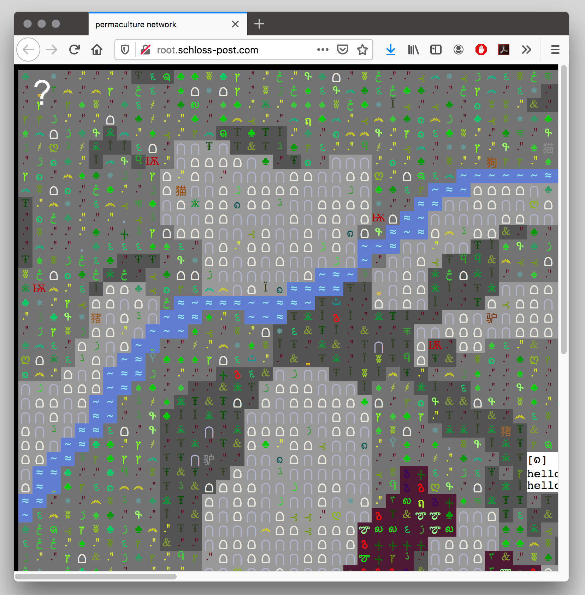

# Project 1 – 1000 Lost Flowers
This is a game about exploring a map in order to find lost items. The game will be based on a tiled grid of divs and use simple ASCII-style graphics (see references at bottom). The grid tiles will derive from a single tile class that can contain different objects, behaviors, and logics.

## Wireframes

## User Story
Users can expect to -
1. Read introduction and click *Generate World* button.
1. Move a character across tiles using keyboard arrow keys or movement buttons on the DOM.
1. Move into a new section of the world when they reach the edge of the map.
1. Not be able to move to unreachable tiles - like walls and rocks
1. Hover on tiles to see a few stats about tile such as type (ie, wall, rock, soil...) and contents
1. Move into special tiles to trigger events like talking to characters, reading hints... These interactions will launch modal dialogs with further options like "Pick up Stone"...
1. See inventory of objects on the screen
1. Be directed to a nice winning dialog screen once they have collected al the lost items

## MVP
1. Map of world is small and stored in a predetermined text format datafile (json). The app would read this data and properly build a grid
2. User interacts with 5 to 10 different dynamic objects – whose positions are randomized – to find a single lost item.

## Stretch Goals
1. Map of world is a a predetermined image file. The app would read this image pixel by pixel and build the gameplay map based on a lookup table of colors that correspond to object types.
1. User interacts with 10 to 20 different dynamic objects to find 2 items.

## Super Stretchy Goals
1. Map of world is procedurally generated following a clear set of rules. Dynamic objects are spawned based on probabilities and rules.
1. There are many many objects to find and user can keep playing as long as they want.

## Graphics references
Permaculture Network - [Link](http://root.schloss-post.com/)

--------
